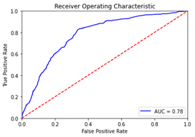
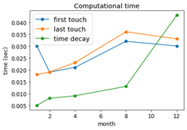
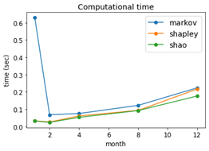
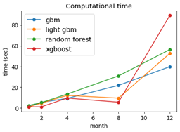

# ModelComparison-for-MTA

На основе подготовленного набора данных в **DataPrep-for-MTA**, в **attribution_comparison.ipynb** и **ensemble.ipynb** была проведена комплексная оценка точности алгоритмов атрибуции по показателю ROC AUC.
- Была создана и обучена модель градиентного бустинга, произведена оценка сложности, подсчитано время работы данного алгоритма.
- После процесса обучения, была выполнена проверка точности классификации, используя площадь ROC-кривой (AUC) и построен график.

Для комплексной оценки производительности указанных алгоритмов и сравнения времени работы указанных алгоритмов с данными по точкам касания клиентов и маркетинговых каналов, аналогичным образом было проведено обучение следующих алгоритмов 
- Random forest
- GBM
- LightGBM
- XGBoost 

на наборах данных, содержащих сведения за 1, 2, 4, 8, 12 месяцев.

Результаты расчета AUC после обучения каждого классификатора:
|   | Technique | Train_AUC | Valid_AUC |
|---|-----------|-----------|-----------|
| **0** | Random Forest | 0.755118 | 0.750259 |
| **1** | GBM | 0.749057 | 0.749828 |
| **2** | LightGBM | 0.745556 | 0.746999 |
| **3** | XGBoost | 0.730077 | 0.736472 |
| **4** | All | 0.757889 | 0.755560 |

В **time_comparison.ipynb** показан сравнительный анализ времени работы всех рассмотренных алгоритмов, визуализация полученных результатов расчета физического времени работы эвристических, алгоритмических моделей атрибуции а также моделей машинного обучения в виде графиков. Показана зависимость физического времени работы алгоритма (в секундах) по оси Y от количества данных (за 1, 2, 4, 8, 12 месяцев) в обрабатываемом наборе по оси X. 

Контрольное количество данных по оси X (за 1, 2, 4, 8, 12 месяцев) для сравнения на графиках обозначено метками.

Сравнение времени работы эвристических моделей:

Сравнение времени работы алгоритмических моделей:

Сравнение времени работы моделей машинного обучения:

